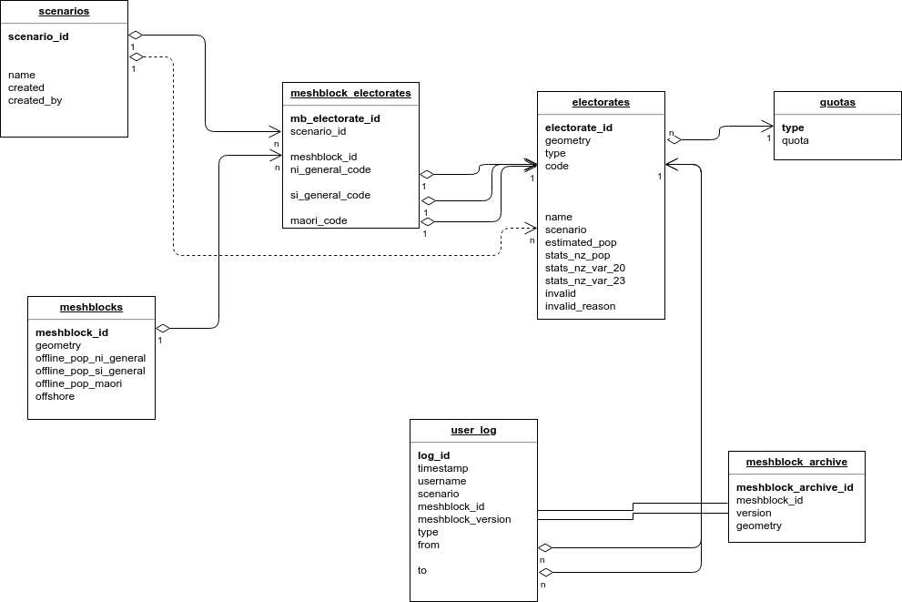

# Document Version

- Current: 3.0.0 (2018-04-17)

# Tables

## meshblocks 

Contains mesh block boundaries and various statistics and properties of these mesh blocks. This is a spatial table, containing MultiPolygon features in EPSG:2193. This table is generally read-only, and is only updated as a result of a user importing a new Mesh Block table from Statistic NZ.

| Column name   | Type          |  Descriptive name | Valid Values | Index | Description
| ------------- | ------------- | ----------------- | ------------ | ----- | ----------
| meshblock_id     | string(20)    | Mesh Block Code   |              | PK    | Unique mesh block ID, e.g. MB 0847800
| geometry      | geometry(MultiPolygon, 2193)  | Mesh Block boundary |  | Spatial | 
| offline_pop_ni_general | int | Offline North Island general population | | | Offline general population of mesh block
| offline_pop_si_general | int | Offline South Island general population | | | Offline general population of mesh block
| offline_pop_maori | int | Offline Maori population | | | Offline Maori population of mesh block	
| offshore | boolean |  | T/F | | True if mesh block is an offshore mesh block

## scenarios

Stores general information relating to districting scenarios. This table is only altered when a user creates a new scenario, or imports a scenario from another user's database file. In this case new records are added, but existing records are never changed.

Initially, the scenario table is populated with a single scenario representing the previously assigned electorates.

| Column name   | Type          |  Descriptive name | Valid Values | Index | Description
| ------------- | ------------- | ----------------- | ------------ | ----- | ----------
| scenario_id     | string(20)  | Scenario ID |              | PK    | Unique scenario ID. Based on a truncated UUID string in order to avoid possible duplicates created by users working concurrently on different copies of the database.
| name     | string(50)  | Scenario Name |              | Unique  | Unique, descriptive name of scenario
| created | datetime | Created Date/Time |              |         | Timestamp from when scenario was created
| created_by | string(30) | Created by |                |         | Username for user who created the scenario

## meshblock_electorates

Links meshblocks to assigned electorates. Assignment is based on scenarios, where a single meshblock will appear only once **per scenario** in this table. This is a non-spatial table.

| Column name   | Type          |  Descriptive name | Valid Values | Index | Description
| ------------- | ------------- | ----------------- | ------------ | ----- | ----------
| mb_scenario_id | int | Unique ID |  | PK | 
| scenario_id     | string(20)  | Scenario ID |              |   Y  | Linked scenario ID
| meshblock_id | string(20) | Mesh Block code |  | Y | Linked meshblock ID code
| ni_general_code | int | North Island General Electorate Code | | | Currently assigned General Electorate to meshblock for scenario
| si_general_code | int | South Island General Electorate Code | | | Currently assigned General Electorate to meshblock for scenario
| maori_code | int | Maori Electorate Code | | | Currently assigned Maori Electorate to meshblock for scenario

## electorates

Contains available General and Maori electorates. This is a spatial table, containing MultiPolygon features in EPSG:2193. Geometries and populations are built from dissolved mesh block boundaries and are updated when the scenario changes or affected meshblocks are redistricted.

| Column name   | Type          |  Descriptive name | Valid Values | Index | Description
| ------------- | ------------- | ----------------- | ------------ | ----- | ----------
| electorate_id     | int    | Electorate ID   |              | PK    | Unique electorate ID
| geometry      | geometry(MultiPolygon, 2193)  | Electorate boundary |  | Spatial | Current dissolved boundary of assigned mesh blocks
| type | string(2) | Electorate type | GN/GS/M  | Y | Contains 'GN' for General North Island electorates, 'GS' for General South Island, or 'M' for Maori electorates
| code | string(4) | Electorate code |  | | Code for electorate, e.g. '0302'
| name | string(50) | Electorate name |  | | Name of electorate
| scenario | string(20) | Current scenario | | | Contains the current scenario from which the cached populations and boundary were calculated
| estimated_pop | int | Estimated population | | | Estimated (offline) population based on rough mesh block populations
| stats_nz_pop | int | Statistics NZ population | | | Population obtained from Statistics NZ API, or NULL if not available
| stats_nz_var_20 | int | Variation from quota  2020 | | | Projected variation from quota as of 2020 obtained from Statistics NZ API, or NULL if not available
| stats_nz_var_23 | int | Variation from quota 2023 | | | Projected variation from quota as of 2023 from Statistics NZ API, or NULL if not available
| invalid | boolean |  | T/F | | True if electorate has failed validation tests
| invalid_reason | string(200) |  | | | String describing why electorate failed validation

## quotas

Contains population quotas for the different electorate types. Used to retrieve the target population quota for electorates.

| Column name   | Type          |  Descriptive name | Valid Values | Index | Description
| ------------- | ------------- | ----------------- | ------------ | ----- | ----------
| type | string(2) | Electorate type | GN/GS/M  | PK | Contains 'GN' for General North Island electorates, 'GS' for General South Island, or 'M' for Maori electorates
| quota | int | Population quota | | | Target population for electorates of this type

## meshblock_archive

Contains archived mesh block boundaries. This is a spatial table, containing MultiPolygon features in EPSG:2193. It is used to store outdated mesh block boundaries after users import a new master mesh block boundary file into the database.

| Column name   | Type          |  Descriptive name | Valid Values | Index | Description
| ------------- | ------------- | ----------------- | ------------ | ----- | ----------
| meshblock_archive_id     | int    | Mesh Block archive ID   |              | PK    | 
| meshblock_id     | string(20)    | Mesh Block Code   |              |     | Unique mesh block ID, e.g. MB 0847800
| version     | string(50)    | Version code   |              |     | Meshblock version ID. This is equal for all meshblocks from the same version of the meshblock table
| geometry      | geometry(MultiPolygon, 2193)  | Mesh Block boundary |  |  | Boundary of mesh block stored as it was when the version of the mesh block table was archived

## user_log

Contains a log of the history of user interactions with the meshblock and electorates. New rows are appended whenever a user redistricts a meshblock whilst using the application.

| Column name   | Type          |  Descriptive name | Valid Values | Index | Description
| ------------- | ------------- | ----------------- | ------------ | ----- | ----------
| log_id    | int    | Log row ID   |              | PK    | 
| timestamp     | datetime    |   |              |     | Timestamp of change
| username | string(30) |  | | | Name of user who performed change
| meshblock_version | string(50) |  | | | Meshblock version ID which the change was based on
| scenario | string(20) |  | | | Scenario in which the change was made
| meshblock_id     | string(20)    | Mesh Block Code   |              |     | ID of mesh block changed, e.g. MB 0847800
| type | string(1) | Electorate type | G/M  |   | Contains 'G' for General electorate changes, 'M' for Maori electorate changes
| from | int| 'From' electorate |   |   | Electorate assigned prior to the change
| to | int| 'To' electorate |   |   | Electorate assigned after the change

